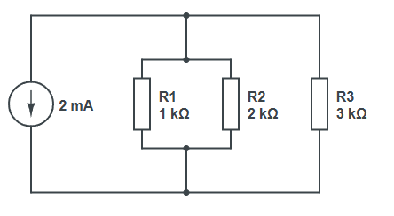
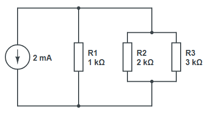

## Composition de composants

On voudrait pouvoir composer des composants entre eux pour former des circuits plus complexes.

L'exemple le plus simple est un circuit en série de deux résistances. La résistance équivalente $R_{eq}$ de deux résistances $R_1$ et $R_2$ en série est simplement la somme des deux résistances : $R_{eq} = R_1 + R_2$. 

Créez une classe `Series` qui prendra en argument deux composants (quelconques !).

Voici un test :
```csharp
Resistance R1 = new Resistance("R1", 1e3);
Resistance R2 = new Resistance("R2", 2e3);
Series S1 = new Series("S1", R1, R2);
DisplayComponent(S1, 2e-3); // affiche "Ser(S1, Res(R1, 1000 Ω), Res(R2, 2000 Ω)), U=6 V"
```

Vérifiez également que la résistance de S1 est bien de $3 \mathrm{k\Omega}$ et affichez la tension aux bornes de S1 pour un courant de $2 \mathrm{mA}$.

Créez ensuite une classe `Parallel` pour modéliser deux résistances en parallèle. La résistance équivalente $R_{eq}$ de deux résistances $R_1$ et $R_2$ en parallèle est donnée par la formule : $\frac{1}{R_{eq}} = \frac{1}{R_1} + \frac{1}{R_2}$.

Le test :
```csharp
Parallel P1 = new Parallel("P1", R1, R2);
DisplayComponent(P1, 2e-3); // affiche "Par(P1, Res(R1, 1000 Ω), Res(R2, 2000 Ω)), U=1,3333333333333333 V"
```

N'oubliez pas que `Series` et `Parallel` sont aussi des composants, et qu'on peut donc les imbriquer ! Pour essayer, créez une troisième résistance R3 de $3 \mathrm{k\Omega}$ et testez les circuits suivants à $2 \mathrm{mA}$ :


| Circuit 1 | Circuit 2 |
| - | - |
|  |  |

- Est-ce que ces deux circuits sont équivalents et donnent la même tension aux bornes, en théorie ?
- Est-ce que c'est le cas en pratique ? Expliquez.

