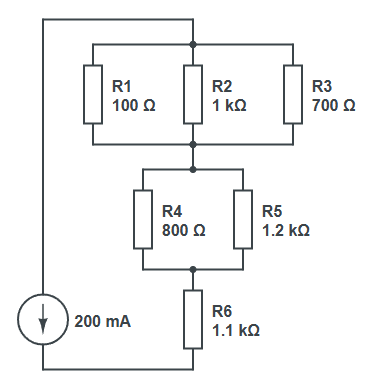

## Collections

On souhaiterait modifier nos composants `Series` et `Parallel` pour qu'ils puissent contenir un nombre quelconque de composants, et pas seulement deux.

Après tout, 
- en série : $R_{eq} = R_1 + R_2 + R_3 + ... + R_n$
- en parallèle : $\frac{1}{R_{eq}} = \frac{1}{R_1} + \frac{1}{R_2} + \frac{1}{R_3} + ... + \frac{1}{R_n}$

> [!TIP]
> Pour stocker plusieurs composants, vous utiliserez une **collection**. En C#, il en existe plusieurs sortes, mais la plus simple est le tableau (`array`). Pour un type `T`, un tableau de `T` s'écrit `T[]`.
>
> On peut créer un tableau à partir d'une liste d'éléments avec `[...]` :
> ```csharp
> int[] tab = [1, 2, 3, 4, 5];
> ```
> On peut parcourir un tableau avec la boucle `foreach` :
> ```csharp
> foreach (int x in tab) {
>     Console.WriteLine(x);
> }
> ```

Affichez la tension aux bornes de ce circuit : (vous devriez trouver environ $332 \mathrm{V}$)


(votre code devrait contenir 2 composants `Parallel` et 1 composant `Series`)

> [!IMPORTANT]
> Le fait d'avoir remplacé les deux composants par un tableau a dû casser votre `ToString` : en effet, les tableaux s'affichent juste comme `Type[]`. Vous pouvez utiliser le code suivant qui convertit un tableau en chaîne séparée par des virgules :
> ```csharp
> string.Join(", ", (object[])monTableau)
> ```
> (la conversion en `object[]` est un détail qui n'est pas important ici)

