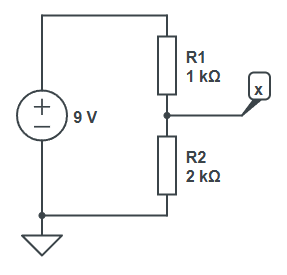

## Pont diviseur de tension

On cherche à modéliser un pont diviseur de tension, c'est-à-dire un circuit composé de deux résistances en série alimentées par une source de tension.



Un tel circuit (bien que peu efficace énergétiquement) permet d'obtenir une tension de sortie $U_x$ plus faible que la tension d'entrée $U_{in}$.

Précisément, $U_x = U_{in} \frac{R_2}{R_1 + R_2}$. Pour l'exemple avec $9 \mathrm{V}$, $1 \mathrm{k\Omega}$ et $2 \mathrm{k\Omega}$, on trouve $U_x = 6 \mathrm{V}$.

Écrivez une fonction `VoltageDivider(double Uin, double Ux, double R1)` qui renvoie un objet `Dipole` modélisant le pont diviseur de tension (n'oubliez pas qu'un diviseur de tension, c'est **deux résistances**, montées en **série**).

Évidemment, votre fonction réutilisera les classes que vous avez déjà définies. Pas besoin d'en créer de nouvelles.

Voici un test :
```csharp
Dipole divider = VoltageDivider(9, 6, 1e3);
Console.WriteLine(divider.GetResistance()); // doit afficher 3000
```