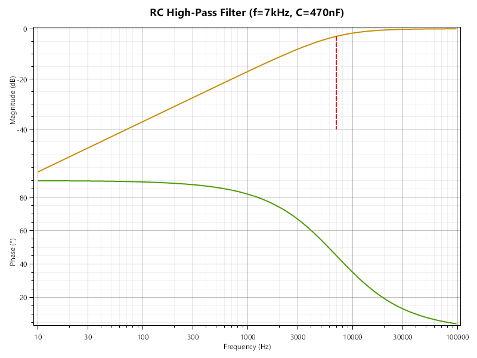

## Filtre passe-haut RC

On va maintenant modéliser un filtre passe-haut, qui laisse passer les hautes fréquences et atténue les basses fréquences.


Il est identique au filtre passe-bas, avec juste la position de la résistance et du condensateur échangée.

En vous basant, au choix, sur vos souvenirs de cours, ou sur la formule du filtre passe-bas, quelle est la formule de son gain $H = \frac{U_{out}}{U_{in}}$ en fonction de la fréquence $f$, de la résistance $R$ et de la capacité $C$ ?

Créez une nouvelle classe `HighpassRC`, en copiant la classe `LowpassRC` et en modifiant ce qu'il faut.

Est-ce qu'il ne serait pas intéressant de mettre en place une hiérarchie de classes ?
- Quelle sera la classe mère ?
- Quelles données et/ou opérations devront être hissées dans la classe mère ?
- La classe mère sera-t-elle abstraite ? ( = a-t-elle un sens isolée, ou ne fournit-elle que des fonctionnalités communes aux classes filles ?)

> [!TIP]
> Il est possible de définir un constructeur dans une classe mère même si elle est abstraite, et d'appeler ce constructeur depuis les classes filles. Par exemple :
> ```csharp
> public abstract class Forme {
>     protected string nom;
>     public Forme(string nom) {
>         this.nom = nom;
>     }
> }
> public class Cercle : Forme {
>     private double rayon;
>     public Cercle(string nom, double rayon) : base(nom) { // appel du constructeur de Forme
>         this.rayon = rayon;
>     }
> }
> ```
> C'est utile car cela évite de dupliquer le code commun aux classes filles, notamment si le constructeur contient de la logique (création d'autres objets, vérifications, etc.)

Quelques images pour vous relaxer, et pour vous laisser le temps de réfléchir, avant de scroller plus bas :


Avez-vous pu hisser dans la classe mère toutes les opérations communes ? Oui ? Si non, pourquoi ?

Testez votre code en créant un filtre passe-haut pour la fréquence $7 \mathrm{kHz}$ et un condensateur de $470 \mathrm{nF}$, et en traçant son diagramme de Bode. Vous aurez peut-être besoin de modifier certains éléments existants de votre projet.

Vous devriez avoir quelque chose comme ça :



TODO: si vous lisez ceci, c'est d'abord que vous êtes très rapide (bravo !), mais surtout que je n'ai pas encore ajouté la suite des exos. Appelez moi pendant le TD.