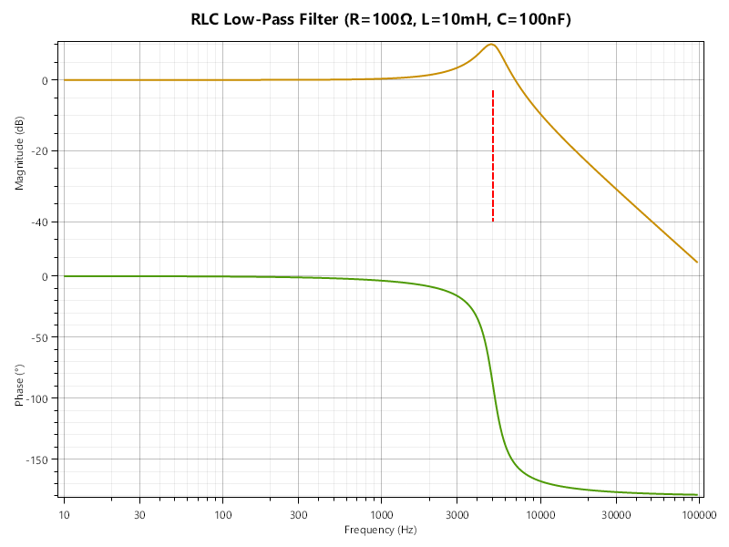
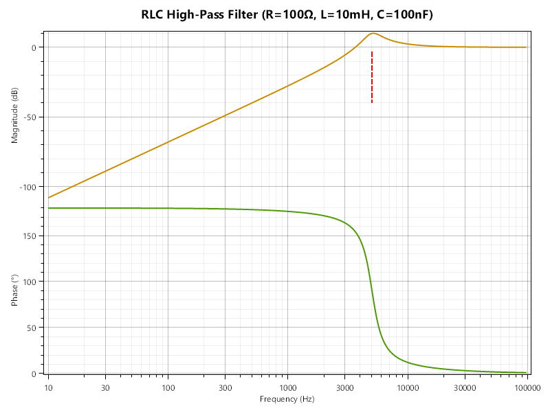
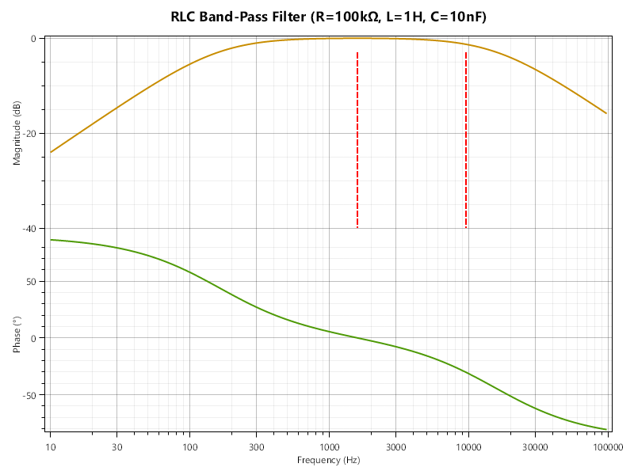
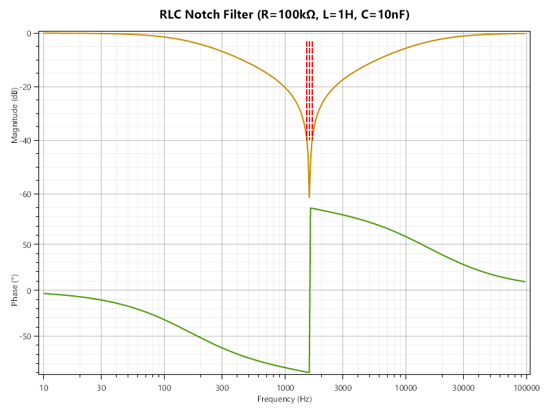

## Filtre RLC

Les filtres RC sont un moyen très simple de filtrer certaines fréquences. Cependant, ils ne sont pas très "sélectifs" : la pente de l'atténuation est de $20 \mathrm{dB}$ par décade (i.e. si on multiplie la fréquence par 10, le gain diminue de $20 \mathrm{dB}$). Pour obtenir une pente plus raide, on peut utiliser des filtres RLC, qui combinent une résistance, une inductance et une capacité.

Là où un montage RC série permet de construire un filtre passe-bas (aux bornes du condensateur) ou un filtre passe-haut (aux bornes de la résistance), un montage RLC (série ou parallèle) permet de construire :
- un filtre passe-bas
- un filtre passe-haut
- un filtre passe-bande
- un filtre coupe-bande

À la manière de `RCFilter` et `RCFilterKind`, créez une classe `RLCFilter` qui permettra de modéliser les quatre types de filtres RLC, en utilisant une énumération `RLCFilterKind` pour indiquer le type de filtre.

Là où `RCFilter` avait `GetCutoffFrequency()`, `RLCFilter` aura une méthode `GetCharacteristicFrequencies()` qui renverra (sous forme d'un `double[]`) les fréquences caractéristiques du filtre :
- pour un passe-bas ou un passe-haut, la fréquence de coupure $f_c = \frac{1}{2 \pi \sqrt{L C}}$
- pour un passe-bande, la fréquence de résonance $f_0 = \frac{1}{2 \pi \sqrt{L C}}$ et les fréquences de coupure $f_c = f_0 \pm \frac{R}{2 \pi L}$
- pour un coupe-bande, la fréquence de résonance $f_0 = \frac{1}{2 \pi \sqrt{L C}}$ et les fréquences de coupure $f_c = f_0 \pm \frac{1}{2 \pi R C}$

On peut retrouver assez rapidement la formule du gain, comme pour le RC, en utilisant les lois de mise en série / parallèle avec les impédances des trois composants. Ça donne :

$$H(f) = \frac{
    \begin{cases} 
        Z_C & \text{passe-bas} \\
        Z_L & \text{passe-haut} \\
        Z_R & \text{passe-bande} \\
        Z_L + Z_C & \text{coupe-bande}
    \end{cases}
}{
    Z_R + Z_L + Z_C
}$$

C'est d'ailleurs comme ça qu'on peut trouver (avec Laplace) une formule reposant uniquement sur les valeurs des composants :

$$s = i2 \pi f$$

$$H(f) = \frac{
    \begin{cases} 
        1 & \text{passe-bas} \\
        L C s^2 & \text{passe-haut} \\
        R C s & \text{passe-bande} \\
        1 + L C s^2 & \text{coupe-bande}
    \end{cases}
}{
    1 + R C s + L C s^2
}$$

Vous pouvez utiliser l'une ou l'autre de ces méthodes pour implémenter `H` dans `RLCFilter`.

On voudrait tester tout ça via un graphique. 

`MakePlot` prend actuellement un `RCFilter`, mais on voudrait qu'elle puisse prendre n'importe quel type de filtre (RC ou RLC). Mettez donc en commun `RCFilter` et `RLCFilter` en créant une classe mère `Filter` qui exposera `H` et `GetCharacteristicFrequencies` (qui, dans le cas de `RCFilter`, renverra la fréquence de coupure). À vous de marquer comme abstrait ou non ce qui doit l'être.

Récupérez ensuite dans [`PlotTools2.cs`](PlotTools2.cs) le nouveau code de la classe `PlotTools` (pour remplacer celui que vous avez).

Une fois que tout est en place, testez les cas suivants et vérifiez que vos graphique sont corrects.
- un filtre passe-bas avec $R=100 \Omega$, $L=10 \mathrm{mH}$, $C=100 \mathrm{nF}$
  - 
- un filtre passe-haut avec $R=100 \Omega$, $L=10 \mathrm{mH}$, $C=100 \mathrm{nF}$
  - 
- un filtre passe-bande avec $R=100 \mathrm{k}\Omega$, $L=1 \mathrm{H}$, $C=10 \mathrm{nF}$
  - 
- un filtre coupe-bande avec $R=100 \mathrm{k}\Omega$, $L=1 \mathrm{H}$, $C=10 \mathrm{nF}$
  - 