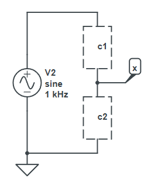
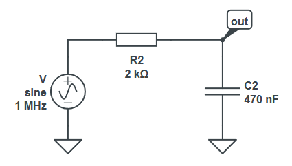
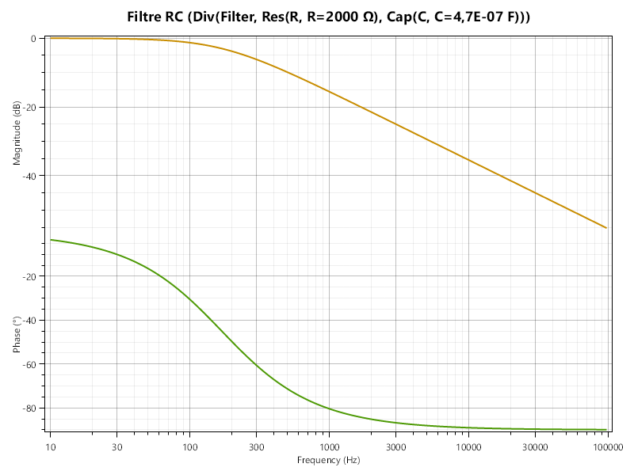
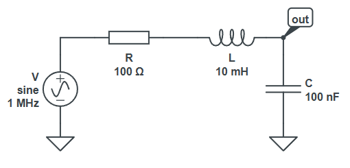
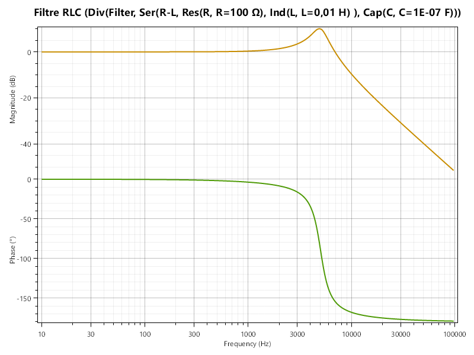
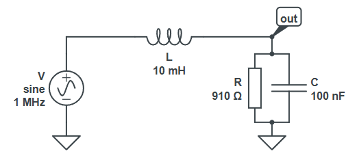
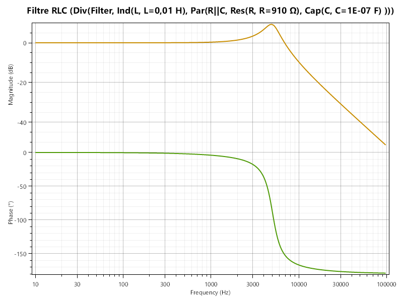

## Retour en arrière : le pont diviseur

Dans la [page 6](p6.md), vous avez implémenté une fonction `VoltageDivider` qui renvoie un `Dipole` modélisant un pont diviseur de tension. À l'époque, le mieux qu'on pouvait faire était de renvoyer une `Resistance` qui représentait la résistance équivalente totale du pont, ce qui n'est pas très utile en soi.

On va ici modéliser un pont quelconque, c'est à dire la jonction de deux dipôles quelconques. L'objet nous permettra de connaître la tension au milieu du pont.



Un tel modèle général est très pratique, car il permet à la fois d'implémenter un bête diviseur de tension, mais également tous les filtres qu'on vient de voir ! En effet, un filtre RC est simplement un pont entre une résistance et un condensateur, et un filtre RLC une association en série ou en parallèle d'une résistance, d'une inductance et d'un condensateur. En combinant les composants avec `Parallel` si besoin, on devrait donc pouvoir construire nos filtres avec un simple pont : ça veut aussi dire qu'on n'aura plus besoin d'écrire "en dur" les formules de transfert dans les classes de filtre, car le pont fera le travail pour nous.

Ainsi, on pourra par exemple faire :
```csharp
Resistance R = new Resistance("R", 2e3);
Capacitor C = new Capacitor("C", 100e-9);
// l'ordre R-C ou C-R détermine si c'est un passe-bas ou un passe-haut
Divider divLowRC = new Divider("Filter", R, C);
PlotTools.MakePlot("Filtre RC", "rc_lowpass_2.png", divLowRC);
Divider divHighRC = new Divider("Filter", C, R);
PlotTools.MakePlot("Filtre RC", "rc_highpass_2.png", divHighRC);
```

Et pour reprendre l'exemple de la page 6, on devrait aussi pouvoir faire :
```csharp
Resistance R1 = new Resistance("R1", 1e3);
Resistance R2 = new Resistance("R2", 2e3);
Divider divider = new Divider("Divider", R1, R2);
DisplayComponent(divider, 2e-3); // doit afficher "Div(Divider, Res(R1, 1000 Ω), Res(R2, 2000 Ω)), U=6 V"
Console.WriteLine(divider.GetResistance()); // doit afficher 3000
```

Créez donc une classe `Divider` qui contiendra deux dipôles, et héritera de... de quoi, au juste ? 
- Elle doit hériter de `Dipole`, pour qu'on puisse l'utiliser dans `DisplayComponent`. À terme, on peut même imaginer mettre plusieurs ponts/filtres en série ou en parallèle.
- Elle doit hériter de `Filter`, pour qu'on puisse l'utiliser dans `MakePlot`.

Or, en C# (et en Java), on ne peut hériter que d'une seule classe à la fois.

> [!TIP] 
> ### Ne vous y trompez pas !
> Bien que couramment enseignée comme une vérité absolue en programmation objet, c'est une limitation tout à fait **arbitraire**. 
> 
> En effet, le C++ et le Python, deux autres langages objets, permettent tout à fait l'héritage multiple. Le C# et le Java ont choisi de ne pas le permettre pour éviter certains problèmes (notamment le "Diamond Problem" ; cherchez-le si vous êtes curieux), mais ce n'est en aucun cas une contrainte inhérente à la programmation objet – c'est un choix de conception qui, dans le cadre de ce cours, orientera nos choix d'architecture.

On va devoir choisir l'une des deux. Là, en fait, les deux options sont en théorie valables. Le choix sera plus humain que formel. L'héritage dénote la "**nature profonde**" d'un objet. Si je mets une résistance et un condensateur en série, j'ai à la fois un *dipôle* (je peux le brancher dans un circuit) et un *filtre* (je peux tracer son gain), mais quand je vais modéliser ça, je vais devoir choisir ce qui convient le mieux comme classe mère.

Pour la classe qui ne sera pas classe mère, on va utiliser un nouveau concept : les interfaces. On a déjà vu le terme "interface" en CM, pour désigner simplement l'ensemble des méthodes publiques d'une classe. Ici, c'est un concept qui porte le même nom et pour une bonne raison : il est très lié au premier.

En C#, une `interface` est une sorte de "classe abstraite pure" : elle ne peut contenir que des méthodes abstraites (sans implémentation). 

En particulier, elle ne peut pas définir de champs. D'un point de vue architectural, une `interface` (au sens C#) définit l'interface (au sens conception) d'un objet, c'est à dire l'ensemble des méthodes qu'il expose. Un champ, comme on l'a vu précédemment via l'encapsulation (`private` / `protected`) est une donnée interne à l'objet, un détail d'implémentation, qui ne regarde aucunement l'extérieur.

> [!TIP] 
> ### Un peu d'explications
> À première vue, on peut se dire que les `interface`s et les `abstract class` font un peu doublon. C'est en partie vrai, à l'exception bien sûr du fait qu'une classe puisse contenir des champs et une interface non. Mais cet aspect "doublon" est un sujet important en programmation depuis des années, et en fait, certains langages n'ont pas d'interfaces (C++, Python), et d'autres n'ont pas de classes abstraites (Go, Rust). En C# et en Java, les deux existent, et ont une sémantique différente :
> - une classe abstraite définit la nature profonde d'un objet (ce qu'il est) ainsi que ses comportements
> - une interface définit un jeu de comportements que différents objets, peu importe leur nature profonde, peuvent implémenter
>
> Exemples :
> - toutes les classes n'ont pas forcément de façon pertinente d'être affichées sous forme de texte. Le C# aurait pu choisir de placer la fonction `ToString()` dans une interface séparée `IAffichable`. Ainsi, les objets désirant fournir une représentation textuelle implémenteraient cette interface, et les autres pas.
> - pour permettre à des objets d'être additionnés entre eux, leur classe va implémenter l'interface `IAdditionOperators` qui définit `operator+`. Ainsi, `int` et `string` pourraient l'implémenter, bien que les deux n'aient pas de lien sémantique (à part le fait d'héiter d'`Object`).

Ici, la classe qui nous servira de classe mère sera `Dipole`. `Divider` héritera de `Dipole` et implémentera l'interface `Filter` (qu'on renommera, par lisibilité, en `IFilter`). Pour la méthode `GetCharacteristicFrequencies`, renvoyez pour l'instant un tableau vide.

> [!NOTE] 
> Le fait que `Filter` soit une interface indépendante de `Dipole`, d'ailleurs, nous servira plus tard car il existe des filtres qui ne sont pas des dipôles (par exemple, un ampli-op). En fait, de façon générale, un filtre est un quadripôle (deux pour la tension d'entrée, deux pour la tension de sortie), et les filtres qu'on a vus jusqu'ici sont des cas particuliers où l'entrée et la sortie partagent un point commun (la masse).

> [!TIP] 
> ### Syntaxe des interfaces
> En C#, une interface s'écrit comme une classe abstraite, mais avec le mot-clé `interface` au lieu de `class`. Par convention, on préfixe le nom d'une interface par un `I` majuscule.
>
> À savoir : comme une `interface` définit l'interface d'un objet, tout ce qu'elle contient est naturellement public. Il n'est donc pas obligatoire de le préciser. Également, la plupart du temps, les méthodes d'une interface seront abstraites (elle ne contiennent pas de code), même s'il est possible de fournir une implémentation par défaut.
>
> Également, il n'y a pas besoin d'utiliser `override` quand on implémente une fonction d'une interface.
>
> Exemple :
> ```csharp
> public abstract class Entite {
>     private string nom;
>     public Entite(string nom) { this.nom = nom; }
>     public string GetNom() { return nom; }
> }
> public interface IFaitBruit {
>     void FaireBruit(); // pas de "public" ni de "abstract"
> }
> public class Chien : Entite, IFaitBruit { // hérite d'Entite et implémente IFaitBruit
>     public Chien(string nom) : base(nom) {}
>     public void FaireBruit() { Console.WriteLine("Wouf !"); } // pas d'"override"
> }
> ```

Pour tester votre pont, voici quelques exemples:

### Passe-bas RC série



```csharp
{
    Resistor R = new Resistor("R", 2e3);
    Capacitor C = new Capacitor("C", 470e-9);
// l'ordre R-C ou C-R détermine si c'est un passe-bas ou un passe-haut
    Divider filter = new Divider("Filter", R, C);
    PlotTools.MakePlot("Filtre RC", "rc_lowpass_2.png", filter);
}
```


Pas mal, non ? On a fait un filtre RC, sans avoir besoin d'écrire nous même la fonction de transfert.

### Passe-bas RLC série



```csharp
{
    Resistor R = new Resistor("R", 100);
    Inductor L = new Inductor("L", 10e-3);
    Capacitor C = new Capacitor("C", 100e-9);
    Divider filter = new Divider("Filter", new Series("R-L", R, L), C);
    PlotTools.MakePlot("Filtre RLC", "rlc_lowpass_2.png", filter);
}
```



Essayez donc de modéliser un passe-bas RLC parallèle, c'est-à-dire : (attention, les valeurs sont différentes)



Vous devriez obtenir :


---

Avec `Series`, `Parallel` et `Divider`, vous avez maintenant de quoi modéliser des circuits assez complexes et puissants. On va même pouvoir faire un peu de ménage dans notre vieux code.