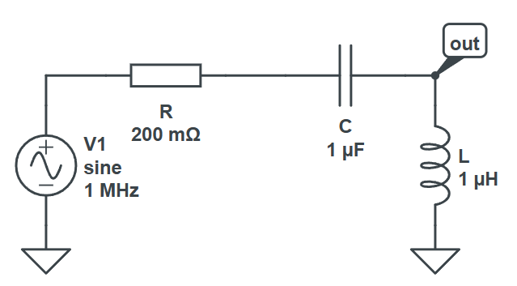
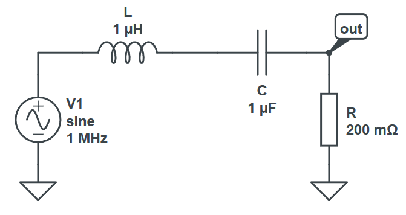
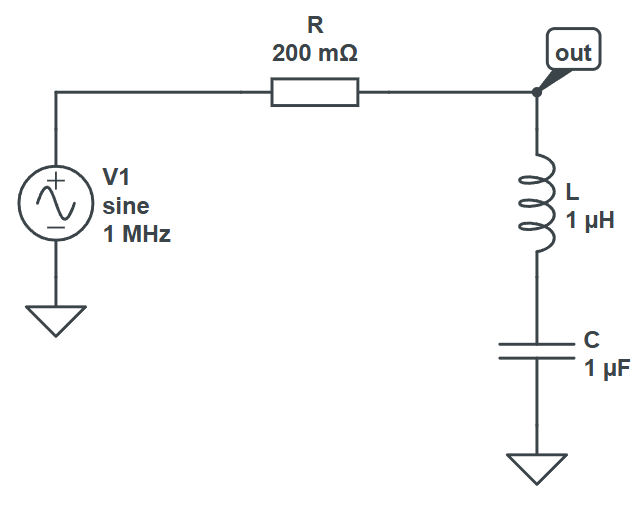

## On fait le ménage : héritage vs composition

Grâce à notre nouvelle classe `Divider`, on a de quoi implémenter des filtres RC et RLC sans écrire directement les fonctions de transfert.

On va donc réécrire nos classes `RCFilter` et `RLCFilter` pour qu'elles utilisent `Divider`, `Series` et `Parallel` au lieu de calculer elles-mêmes la fonction de transfert.

Vont-elles en hériter ? C'est ce à quoi vous allez peut-être penser, mais ça ne serait pas une bonne idée ici. Le fait qu'un filter RC utilise `Divider` est un détail d'implémentation, autrement dit une information sur comment le filtre fait ses calculs, mais pas quelque chose qui concerne les gens qui vont s'en servir. On peut donc faire différemment : au lieu de faire de l'**héritage** (`class RCFilter : Divider`), on va faire de la **composition**, c'est-à-dire que `RCFilter` va contenir un `Divider` en tant que champ privé, et déléguer l'appel de `H` à ce `Divider`.

> [!TIP] 
> Une architecture basée sur de l'héritage peut toujours être remplacée par des interfaces et de la composition. La question de savoir laquelle des deux approches est la meilleure est complexe et dépend souvent des goûts de la personne qui écrit le code. Certains langages ne contiennent pas d'héritage (Go, Rust), et forcent la composition.
>
> De façon générale, la composition modélise une relation "has-a" là où l'héritage modélise une relation "is-a", et une relation du monde réel peut souvent être vue d'une façon ou de l'autre.

Les filtres devront du coup aussi contenir des champs `double` pour leurs paramètres (résistance, capacité, inductance) ainsi que leur type, car ça servira pour le `ToString` et les fonctions de calcul de fréquences caractéristiques.

Bref, pour résumer : le constructeur et les méthodes ne changent pas de tête, mais le constructeur crée un `Divider` avec les bons composants, et `H` appelle `H` sur ce `Divider`.

Pour le RC, comme on a dit, c'est un simple montage série R-C, dont l'ordre détermine s'il s'agit d'un passe-bas ou d'un passe-haut.

Pour le RLC, les montages sont les suivants :

| Montage | Schéma |
|-|-|
| Passe-bas |  |
| Passe-haut |  |
| Passe-bande |  |
| Coupe-bande |  |

À vous !

Vous vérifierez que les graphiques produits sont identiques à ceux que vous aviez avant (ceux des pages [8](p08.md), [10](p10.md) et [12](p12.md)).