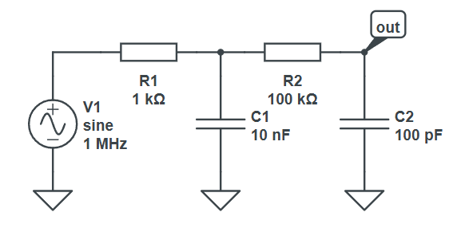

## Filtres composés

On va modéliser un filtre RC passe-bas du second ordre : 


On ne peut pas tout à fait utiliser nos classes `Series` et `Parallel` car la tension de sortie se trouve "au milieu" du circuit. 

Ce qu'on peut faire, en revanche, c'est raisonner un niveau plus haut, et ne pas penser en termes de dipôles mais en termes de blocs fonctionnels :

- les fonctions de transfert se multiplient en série : $H(f) = H_1(f) H_2(f)$

    

- les fonctions de transfert s'additionnent en parallèle : $H(f) = H_1(f) + H_2(f)$

    

Créez donc deux classes `SeriesFilter` et `ParallelFilter` qui implémentent cela (c'est à dire : la mise en commun de N filtres). Renvoyez un tableau vide pour `GetCharacteristicFrequencies`.

Voici un test :

```csharp
{
    RCFilter f1 = new RCFilter(1e3, 0.01e-6, RCFilterKind.Lowpass);
    RCFilter f2 = new RCFilter(100e3, 0.0001e-6, RCFilterKind.Lowpass);
    SeriesFilter ff = new SeriesFilter([f1, f2]);
    PlotTools.MakePlot("Filtre RC 2nd ordre", "rc_2order.png", ff);
}
```


On observe directement la différence de pente (-40 dB/décade) par rapport au filtre RC du premier ordre (-20 dB/décade).

---

Un autre test, modélisez un filtre passe-bas de Chebyshev :


Ça nous donne un joli filtre avec -110 dB/décade dans la partie haute !

