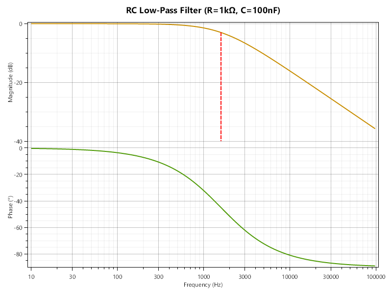

## Filtre passe-bas RC

On souhaite modéliser un filtre passe-bas construit à l'aide d'une résistance et d'un condensateur mis en série.


En suivant la même formule que pour un pont diviseur (c'est-à-dire, en fait, deux composants mis en série), on a:

$$U_{out} = U_{in} \frac{Z_C}{R + Z_C}$$

La fréquence de coupure (en $\mathrm{Hz}$), quant à elle, est donnée par :

$$f_c = \frac{1}{2 \pi R C}$$

On prendra comme exemple ici $R = 1\,\mathrm{k\Omega}$ et $C = 100\,\mathrm{nF}$, ce qui donne une fréquence de coupure d'environ $1591\,\mathrm{Hz}$.

Créez une classe `LowpassRC` qui prendra en argument une valeur en ohms pour la résistance et une valeur en farads pour le condensateur. 

Dotez-la d'une méthode `GetCutoffFrequency()` qui renverra la fréquence de coupure.

Enfin, ajoutez-lui une méthode `H` qui prendra en argument une fréquence `fHz` (en $\mathrm{Hz}$) et renverra le gain (complexe) du filtre à cette fréquence, c'est-à-dire le rapport $\frac{U_{out}}{U_{in}}$.

---

Testez votre code en créant un filtre RC avec les valeurs données plus haut, et en affichant la fréquence de coupure.

---

On voudrait tester numériquement que notre filtre se comporte bien comme un passe-bas. Pour cela, calculez et affichez le gain (sous la forme de sa valeur absolue et de sa phase) du filtre pour les fréquences suivantes : $1\,\mathrm{Hz}$, $10\,\mathrm{Hz}$, $100\,\mathrm{Hz}$, $1\,\mathrm{kHz}$, $10\,\mathrm{kHz}$, $100\,\mathrm{kHz}$ et $1\,\mathrm{MHz}$.

> [!TIP]
> Utilisez une boucle. Par exemple, pour afficher les nombres de 0 à 9 :
> ```csharp
> foreach (int i in Enumerable.Range(0, 10)) {
>     Console.WriteLine(i);
> }
> ```
> Vous pouvez aussi utiliser une boucle "façon C" :
> ```csharp
> for (int i = 0; i < 10; i++) {
>     Console.WriteLine(i);
> }
> ```
> (à vous de trouver comment on peut faire des puissances de 10 comme ça...)

Vous devriez avoir quelque chose comme ça :
```
  f=      1 Hz -> |H|=     1, ∠H=  -,04°
  f=     10 Hz -> |H|=     1, ∠H=  -,36°
  f=    100 Hz -> |H|= 0,998, ∠H= -3,60°
  f=   1000 Hz -> |H|= 0,847, ∠H=-32,14°
  f=  10000 Hz -> |H|= 0,157, ∠H=-80,96°
  f= 100000 Hz -> |H|= 0,016, ∠H=-89,09°
  f=1000000 Hz -> |H|= 0,002, ∠H=-89,91°
```

On voit bien l'inflexion autour de la fréquence de coupure (vers $1591\,\mathrm{Hz}$), et que le gain devient très faible pour les hautes fréquences.

> [!TIP]
> Lorsque vous insérez des valeurs dans une chaîne, vous pouvez spécifier un **format**. Pour les nombres, ça inclut le nombre de chiffres après la virgule, le nombre total de chiffres, etc. Par exemple :
> ```csharp
> double maVariable = 4.0 / 3.0;
> Console.WriteLine($"x = {maVariable:0.###}"); // affiche "x = 1,333"
> Console.WriteLine($"x = {maVariable:000.0}"); // affiche "x = 001,3"
> Console.WriteLine($"x = {maVariable,8:0.00000}"); // affiche "x =  1,33333" (8 caractères au total, incluant les espaces devant)
> ```

### Graphique

Ouvrez la recherche d'action (Ctrl+Maj+A) et cherchez "NuGet". Cela vous ouvrira le panneau de gestion de packages.

Installez le package `OxyPlot.SkiaSharp` et ajoutez `using OxyPlot;` en haut de votre fichier `Program.cs`.

Copiez ensuite le fichier [PlotTools.cs](./PlotTools.cs) dans votre projet, à côté de `Program.cs` (vous pouvez le copier depuis l'explorateur de fichiers, puis faire Ctrl+V dans Rider, dans le panneau de gauche).

Dans votre programme principal, appelez enfin la fonction `PlotTools.MakePlot` pour générer un graphique du gain en fonction de la fréquence, par exemple :

```csharp
LowpassRC filter = new LowpassRC(1e3, 100e-9);
PlotTools.MakePlot("Filtre RC", "LowpassRC.png", filter);
```

Lancez le programme. Ouvrez ensuite le dossier du projet, en faisant clic droit sur le projet dans Rider, puis "Open In" → "Explorer". Naviguez dans bin/Debug/net9.0, et ouvrez le fichier `LowpassRC.png`.

Vous devriez avoir un beau diagramme de Bode, comme ceci :

